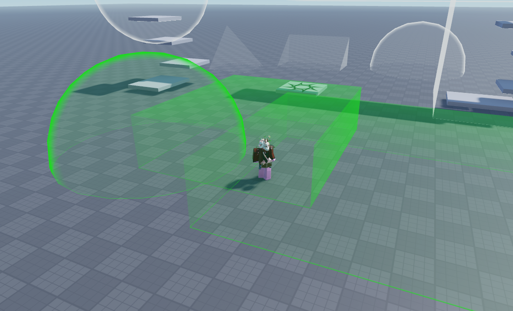

# ComplexRegions

[](https://github.com/vocksel/complex-regions/actions/workflows/ci.yml)
[](https://vocksel.github.io/complex-regions)

This is a package that allows you to define regions in an experience out of BaseParts of any shape or size.



## Usage

```lua
local region = ComplexRegions.createRegion(workspace.Region, {
    Players.LocalPlayer.Character
})

region.entered:Connect(function(instance: Instance)
    print(instance, "entered the region")
end)

region.left:Connect(function(instance: Instance)
    print(instance, "left the region")
end)
```

## Installation

Installing the package is quick and easy whether you use a package manager like [Wally](https://github.com/UpliftGames/wally) or work directly in Studio.

### Wally (Recommended)

Add the following to your `wally.toml` and run `wally install` to download the package.

```toml
[dependencies]
ComplexRegions = "vocksel/complex-regions@0.1.1"
```

Make sure the resulting `Packages` folder is synced into your experience using a tool like [Rojo](https://github.com/rojo-rbx/rojo/).

### Roblox Studio

* Download a copy of the rbxm from the [releases page](https://github.com/vocksel/complex-regions/releases/latest) under the Assets section.
* Drag and drop the file into Roblox Studio to add it to your experience.
## Documentation

You can find the documentation [here](https://vocksel.github.io/complex-regions).

## Contributing

See the [contributing guide](https://vocksel.github.io/complex-regions/docs/contributing).

## License

[MIT License](LICENSE)